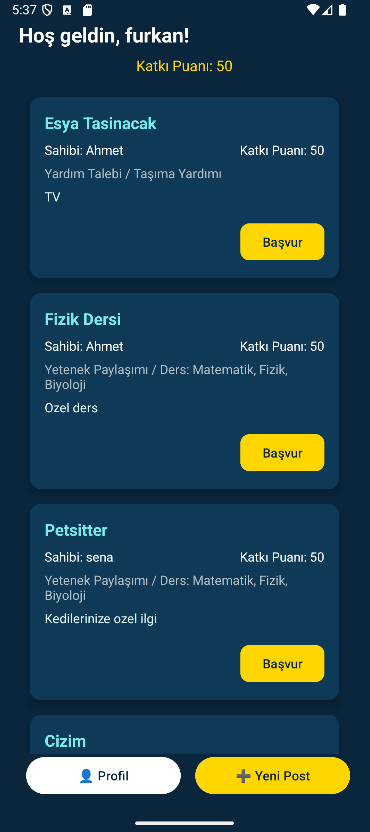
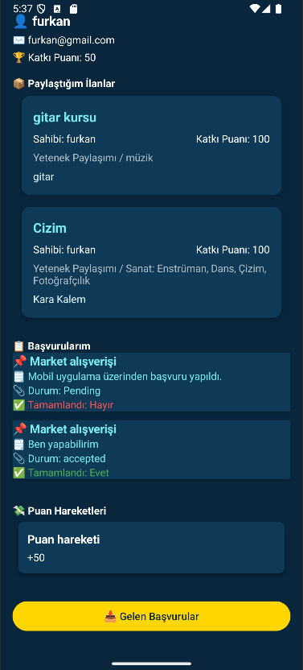
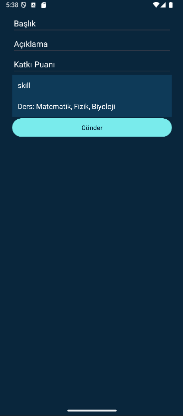
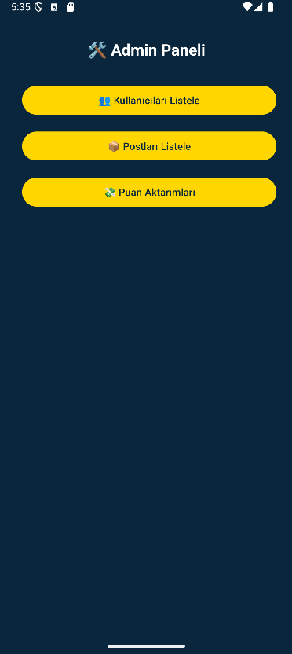
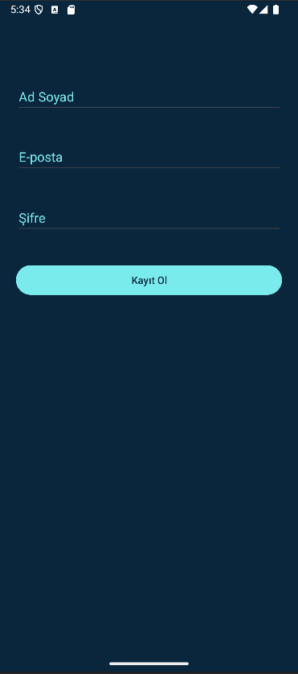
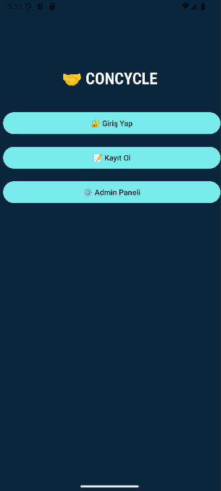

# Concycle Mobile App - Android (Java)

Concycle is a digital platform that facilitates the exchange of knowledge, skills, and assistance requests among its users in exchange for contribution points. The objective is to cultivate a culture of mutual support within the community, thereby enabling individuals to access personal development experiences and everyday assistance — without the need for monetary resources.

---

## 📱 Mobile App (Android - Java)

## 📸 Screenshots

> Below are some screens demonstrating the core functionality and user interface of the app:

### 🏠 Home Screen

### 🧍 Profile Screen

### ➕ New Post Screen

### 🛠️ Admin Panel

### 🔐 Login Screen

### 🚪 Main Entry Screen

---

### Features:
- User registration and login
- Create new posts (either help request or skill sharing)
- Apply to other users' posts
- Track application status (Pending, Accepted, Rejected)
- When help is completed, score is transferred between users
- Profile page includes posts, applications, and score history
- Admin panel: manage users, posts, and score transactions

---

### Technologies Used:
- Java (Android Studio)
- Volley HTTP library for API communication
- RecyclerView, CardView, ConstraintLayout, Spinner
- Intent-based navigation and data passing
- Custom dark theme with icons and improved UX

---

## 🚀 How to Run

1. Open `ConcycleMobile/` in Android Studio
2. Use `10.0.2.2:5047` as base URL to access local API from emulator

## 👨‍💻 Developer

[LinkedIn: Furkan Yıldız](https://www.linkedin.com/in/furkan-yıldız-584383254)
